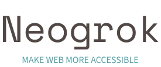

# Summary

Neogrok is the open source alternative to the [ngrok](https://ngrok.com).

# Plan

## Authorization

- [ ] Database
- [x] Universal password

## Supported protocols

- [ ] **HTTP** - `high priority`
- [x] **TCP**  - `high priority`
- [ ] **UDP**  - `low priority`

## Internals

- [x] Packet compression
  - [ ] Ability to change algorithm (Currently algorithm is semi-hardcoded)
  - [ ] Enable dictionary loading (mainly zstd)
- [ ] Protocol similar to the `ENet` instead of plain `TCP`
